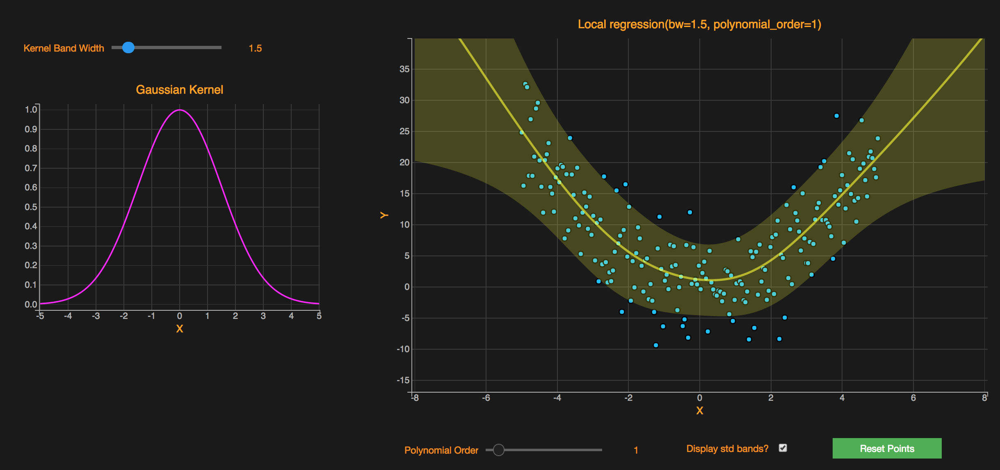
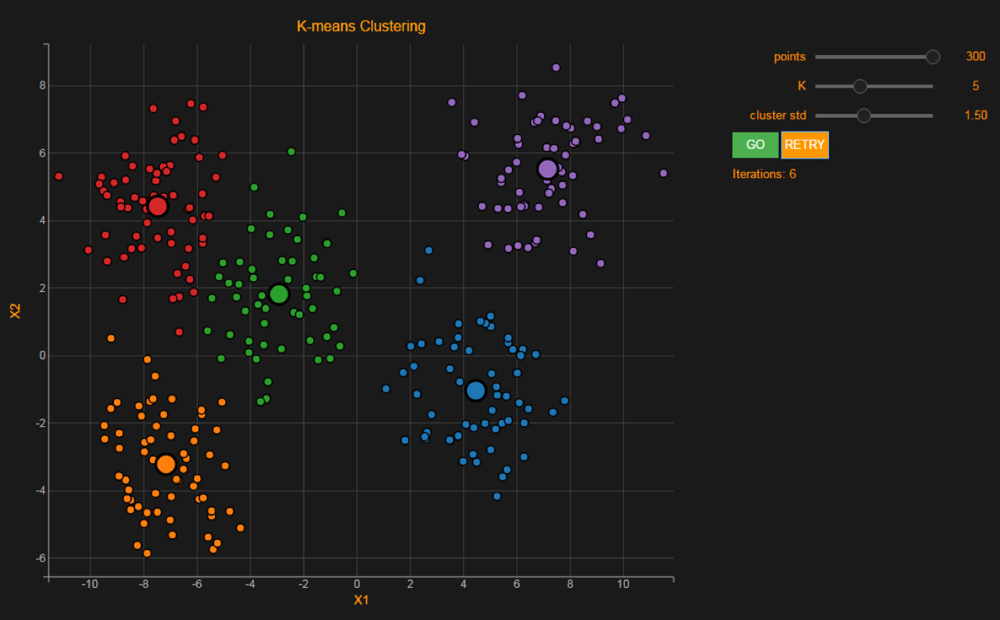
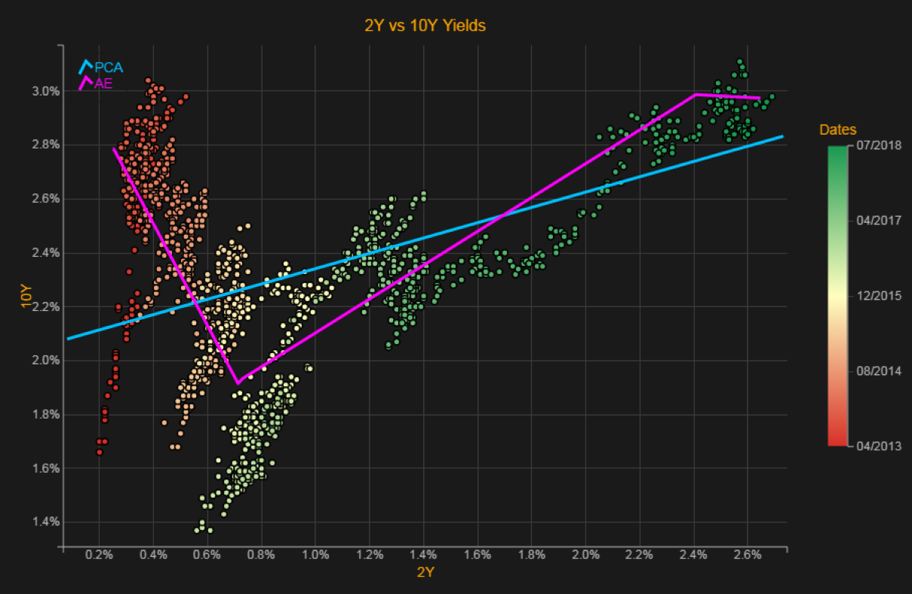
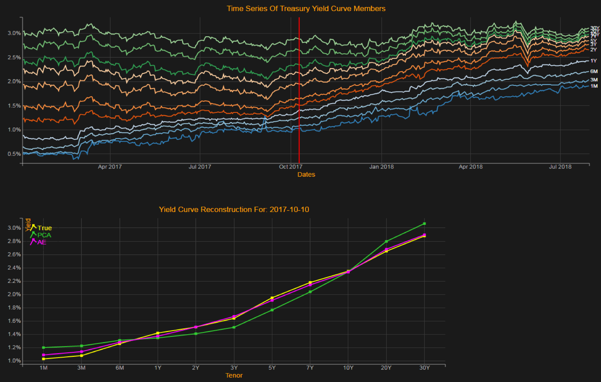
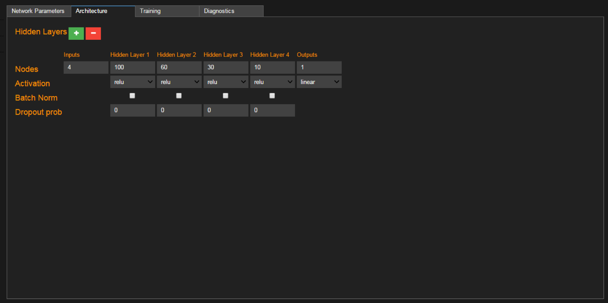
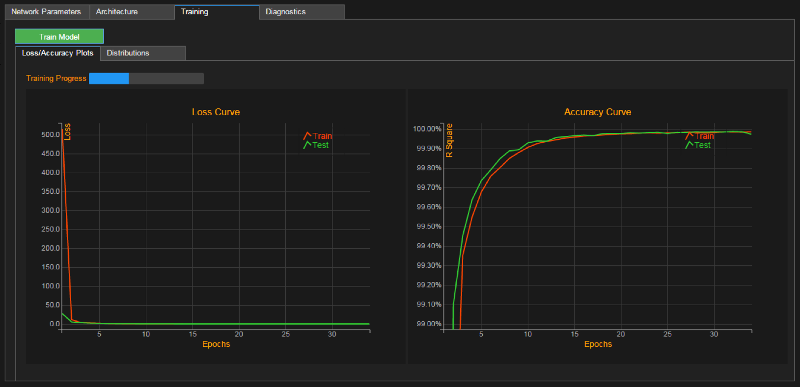
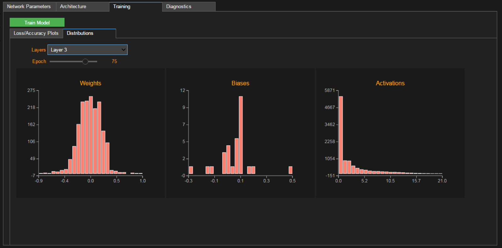

# JupyterCon 2018
Notebooks and code of my 2018 JupyterCon [talk](https://conferences.oreilly.com/jupyter/jup-ny/public/schedule/detail/71406)

## Dependencies

The notebooks and code depend on the following python packages:

- `numpy` (Version 1.13.3)
- `scipy` (Version 1.0.0)
- `pandas` (Version 0.22.0)
- `sklearn` (Version 0.18.1)
- `tensorflow`(Version 1.0.0)
- `keras` (Version 2.0.3)
- `ipywidgets` (Version 6.0.0)
- `bqplot` (Version 0.9.1)

## Notes
* All the examples in the talk were run in a black-themed notebook (and black-themed `ipywidgets` and `bqplot`). The colors used in the visualizations and plots were chosen to work well on the black background. Since the classic notebooks are white-themed please update the colors (especially lighter colors like yellow) accordingly.
* Special add-ons like full-screen button etc. were used to render the visualizations on a full screen. These are not available by default in the classic Jupyter notebook.

(Hopefully with Jupyterlab black-themed notebooks/widgets and full-screen rendering will be available for all)

The following models/algorithms/tools were covered in the talk:
* Kernel Regression

* K-Means Clustering

* Dimensionality Reduction (PCA vs Autoencoder)

* Neural Network Builder

